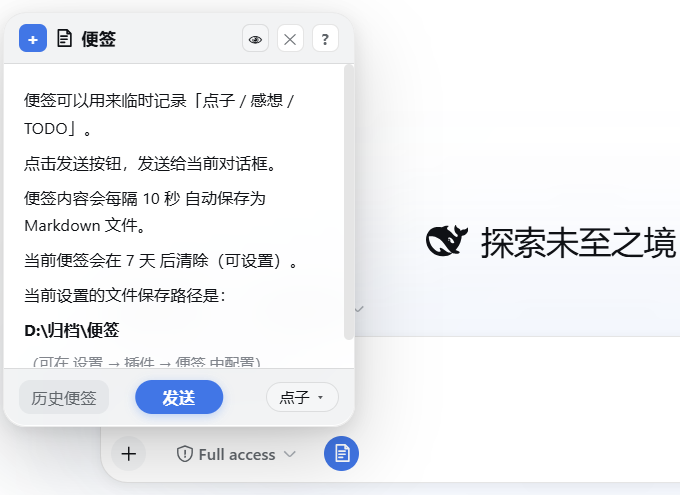

# dsh-sticky-note

[](https://github.com/deepseek-ai/deepseek-harness/releases/tag/dsh-v0.2.0-rc.2)

左下角便签：随手记点子 / 感想 / TODO，实时保存到归档目录，清单 + 悬浮归档。

> 适配 DSH `0.2.0-rc.2`：用户配置改用插件自己的 `Config`（volatile 字段写回 profile patch），设置卡片继续挂在插件管理器的详情页。



## ✨ 功能

- 📝 **随手记**：编辑框工具栏上的便签按钮，点击弹出便签面板
- 📍 **可选固定**：从标题栏操作中固定后吸附到屏幕边缘，外部点击不再关闭；固定状态与位置会被记住
- 🔁 **可选续写**：可在插件设置中选择重新打开时继续当前草稿；默认关闭，保持原有行为
- 🔎 **整体缩放**：标题栏操作提供 `− / 倍率 / +`，支持 `Cmd/Ctrl + + / - / 0`，倍率会被记住
- 💾 **自动保存**：按设定间隔（10 秒 / 1 分钟 / 5 分钟）自动落盘，`Ctrl+S` 立即保存
- 🏷️ **三分类**：点子 / 感想 / TODO，快捷键 `Ctrl+Shift+1/2/3` 切换
- 📤 **一键发送**：便签内容直接发给当前对话（或追加到输入框）
- 📋 **历史便签**：分组清单 + 展开收起，双击查看、单击预备发送，归档分组可一键恢复
- ✏️ **可编辑**：历史便签可二次编辑保存；外部编辑器改动后查看视图自动刷新
- 📌 **选择保留**：标记保留的便签不会被自动清除（针形图标）
- 🧹 **自动清除**：按最后修改时间计龄，超期未保留的先移入「已清除」回收站（保留 30 天），Host 定时触发
- 🖥️ **Markdown**：编辑 ↔ 实时预览（`Ctrl+Shift+V`），支持表格 / 任务列表 / 删除线 / 图片
- 🌓 **深色模式**：全部配色跟随 DSW 主题变量，深浅自动切换
- ⌨️ **快捷键**：`Esc` 层层退出、`Tab/Shift+Tab` 缩进、`Ctrl+Shift+X` 删除线、`Ctrl+Shift+T` 任务项、`Ctrl+T` 表格骨架等
- ⚙️ **可配置**：存储路径、保存间隔、清除周期、默认类别、发送方式、是否继续当前草稿

## 📦 安装

```sh
dsh plugin --profile web add github:Meredith2328/dsh-sticky-note
```

或本地目录：

```sh
dsh plugin --profile web add file:/path/to/dsh-sticky-note
```

安装后重启 DSH（Web 或 Desktop）。

> 请不要使用裸包名 `dsh plugin ... add dsh-sticky-note`；npm 上的同名包不是本项目。

**版本对应关系**：

- 便签 v0.6.0 → DSH `0.2.0-rc.2`
- 便签 v0.5.0 → DSH `0.1.6-alpha.2`
- 便签 v0.2.3 → DSH `0.1.0-rc.7` ~ `0.1.1-rc.2`

v0.6.0 的适配集中在配置的存取接缝上。`@deepseek-ai/dsh-settings` 不再提供 `ctx.settings.register(namespace, schema)`：插件改成导出自己的 `Config`，把用户可改的字段标成 `.volatile()`，Loader 解析后作为 `apply(ctx, config)` 的第二参数下发，字段是带 `.get()` 的引用，设置表单与 profile patch 都按这份 schema 走；写回改用 `ctx.settings.update(条目 id, patch)`，并通过 `ctx.settings.configure({ auto: false }, ctx.fiber)` 说明设置页由插件自己的卡片渲染。同时 `connection.rpc.handle` 只收 `(channel, handler)`，旧的 `{ authority: 'loopback' }` 选项已经不存在；`settings.plugin.item` 插槽在 0.2.0 里没有声明，旧的兜底注册一并删除。读不到 settings 服务时（例如测试直连 handler）仍旧退回 `~/.dsh/sticky-note-config.json`。

## 🗂️ 存储结构

```
<root>/
├── 点子/    ← 以时间戳命名的 .md 文件
├── 感想/
├── TODO/
├── 归档/    ← 归档的便签（前缀类别名，可一键恢复）
└── 已清除/  ← 自动清除的回收站（保留 30 天）
```

默认根路径 `~/.dsh/sticky-notes`（`DSH_HOME` 下），可在设置页修改。

## 🤝 贡献

外部贡献采用先 Issue、后 PR 的流程。请先阅读 [CONTRIBUTING.md](CONTRIBUTING.md)；未经确认的 PR 暂不进入人工代码审查。

## 📄 License

MIT
